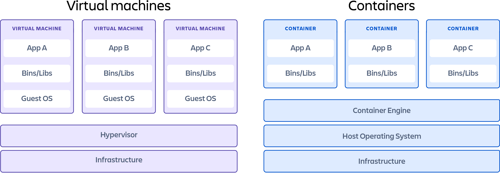
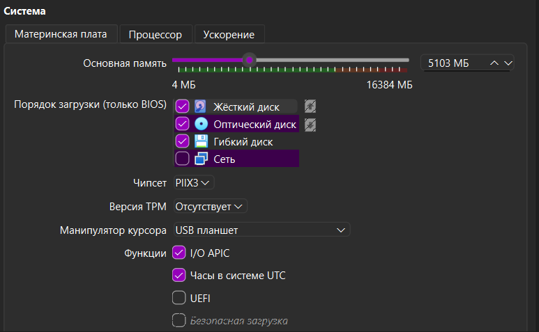
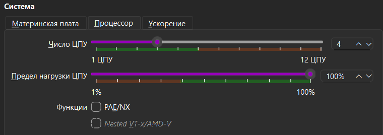
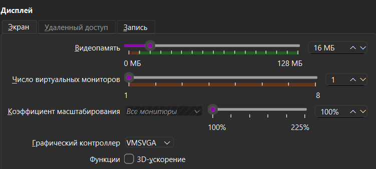

# Виртуализация, установка VirtualBox, выбор образов
## Постановка задач
## Теория:
1. Разобраться, чем виртуальная машина отличается от контейнера и физического сервера,
2. Посмотреть, чем VirtualBox отличается от VMware Workstation/Player,
3. Скачать образ Ubunty Server(LTS-version) - первая виртуальная машина.

## Практика: Создать ВМ с Ubuntu Server и установить систему
4. Установить VirtualBox,
5. Создать новую ВМ: минимум 2 ГБ RAM, 20 ГБ диска, 2 ядра CPU,
6. Подключить образ Ubuntu Server и пройти установку: язык, диск пользователь, ssh-сервер,
7. После установки войти под своим пользователем и выполнить sudo apt update && sudo apt upgrade.

## Выполнение задач
### 1. Чем же виртуальная машина отличается от контейнера и физического сервера?
### Что такое виртуальная машина?

Виртуальные машины — это тяжелые программные пакеты, которые обеспечивают полную эмуляцию низкоуровневых аппаратных устройств, таких как ЦП, дисковые и сетевые устройства. Виртуальная машина также может включать дополнительный программный стек для запуска на эмулируемых аппаратных средствах. Такие пакеты аппаратных и программных средств представляют собой полнофункциональный снимок вычислительной системы.

### Что такое контейнер?

Контейнеры — это легкие программные пакеты, содержащие все зависимости, необходимые для запуска автономного программного приложения. К этим зависимостям относятся системные библиотеки, сторонние пакеты кода и другие приложения уровня операционной системы. Зависимости, входящие в контейнер, находятся на уровнях стека выше уровня операционной системы.

### Сравним контейнеры и виртуальные машины

Контейнеры и виртуальные машины — очень похожие между собой технологии виртуализации ресурсов. Виртуализация — это процесс, при котором один системный ресурс, такой как оперативная память, ЦП, диск или сеть, может быть виртуализирован и представлен в виде множества ресурсов. Основное различие контейнеров и виртуальных машин заключается в том, что виртуальные машины виртуализируют весь компьютер вплоть до аппаратных уровней, а контейнеры — только программные уровни выше уровня операционной системы.



### Виртуальный или физический: в чем разница?

 Физическсий сервер

Физический сервер — это отдельный компьютер, полностью выделенный под задачи одного клиента или компании. Он работает на собственном железе (процессор, RAM, диски) без разделения ресурсов с другими пользователями. 

Ключевые особенности физического сервера 
- Полный контроль — можно настроить аппаратную часть под конкретные нужды (например, мощные GPU для расчетов или RAID-массивы для надежности)
- Предсказуемая производительность — ресурсы не делятся с другими, поэтому нет «соседей», которые могут перегрузить систему
- Высокая изоляция — безопасность данных зависит только от администратора сервера, нет рисков утечек из-за ошибок виртуализации
- Высокая стоимость — нужно покупать или арендовать оборудование, обеспечивать электропитание и охлаждение

Виртуальный сервер (VPS/VDS)

Виртуальные серверы выбирают для высоконагруженных проектов, баз данных, корпоративных систем с жесткими требованиями к безопасности. 

Ключевые особенности виртуального сервера:
- Гибкость — можно быстро увеличить или уменьшить ресурсы (CPU, RAM, диски) без замены железа
- Экономия — аренда VPS дешевле, чем содержание физического сервера, так как затраты распределяются между клиентами
- Масштабируемость — легко развернуть несколько виртуальных серверов под разные задачи (веб-приложение, почта, тестовая среда)
- Зависимость от хоста — если физический сервер перегружен или вышел из строя, это может затронуть все виртуальные серверы на нем

### 2. Чем отличается VirtualBox от VMware?

1. Лицензия и стоимость
    - VirtualBox: Бесплатная программа с открытым исходным кодом (GNU GPL v3). Дополнительный пакет Extension Pack бесплатен для личного использования, но требует платной подписки для коммерческого применения.
    - VMware Workstation Pro: Продукты VMware для персонального и коммерческого использования стали бесплатными, однако установка требует регистрации учетной записи
2. Производительность и скорость
    - VirtualBox: Работает медленнее при нагрузках и хуже справляется с трехмерной (3D) графикой.
    - VMware: Обеспечивает более высокую общую производительность, быстрый отклик и качественное ускорение графики.
3. Форматы виртуальных дисков
    - VirtualBox: Поддерживает множество форматов: VDI, VMDK, VHD и другие.
    - VMware: Работает преимущественно с родным форматом VMDK.

Что выбрать?
- Выбирайте VirtualBox, если вам нужна простая, полностью бесплатная программа для базовых задач или старта.
- Выбирайте VMware, если важна максимальная скорость работы виртуальных машин и продвинутая поддержка оборудования

### 3. Скачивание Ubuntu Server LTS

Скачивание Ubuntu 24.04 LTS доступно по ссылке [клик](https://releases.ubuntu.com/24.04/)

### 4. Установка VirtualBox 
Ничего сложного, смысла комментировать не вижу

### 5. Создание новой ВМ

### Характеристики на экране: 







# ИТОГ
Сегодня я узнал, что такое контейнеры, ВМ, разницу между ними, создал ВМ, поставил ubuntu 24.04 и выполнил в ней
```bash
sudo apt update && sudo apt upgrade
``` 
